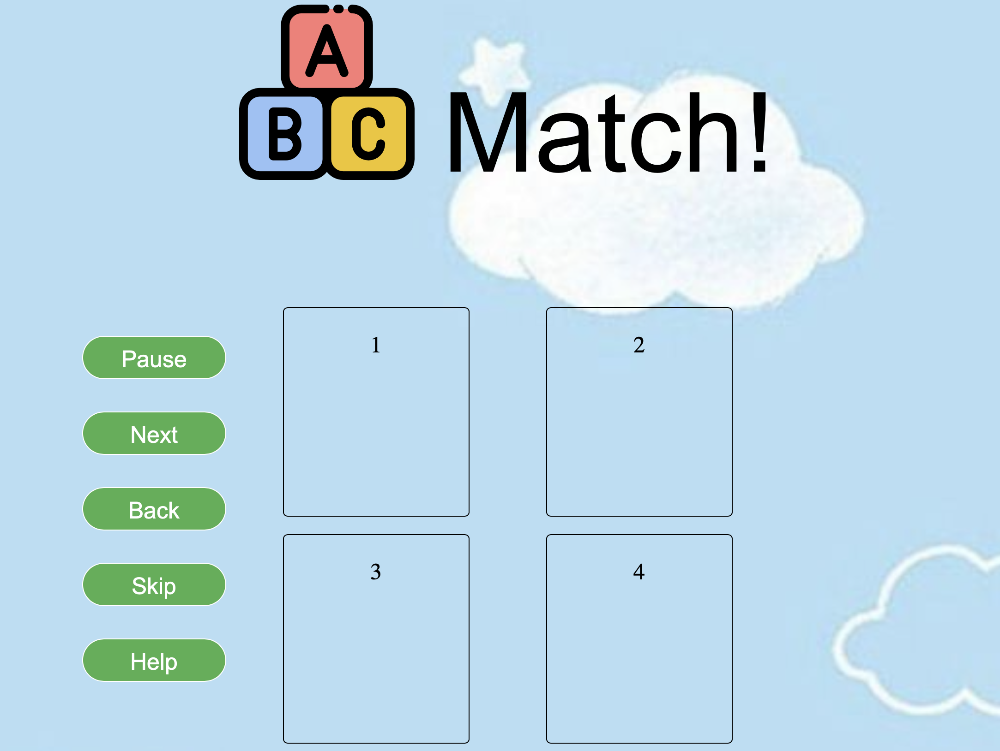

# ABC Match!
This is a project I am working on to create a simple game using HTML, CSS, and Javascript.

## Description
A game to help children learn their alphabet and image recognition. By using the 4 boxes at the centre of the screen, letters of the alphabet will be matched to the appropriate image of an object that begins with the same letter. The timer will count how long it takes to match 26 letters to the photos while the score function adds a point for the correct answer, and deducts a point for an incorrect answer. 

## Motivation
A project created to help me better understand the use of HTML, CSS and introduce myself to JavaScript functions.
## Deployment

## Screenshot

